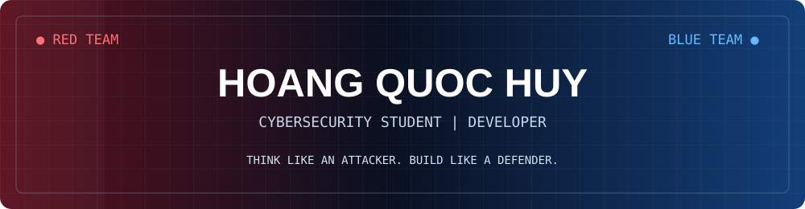
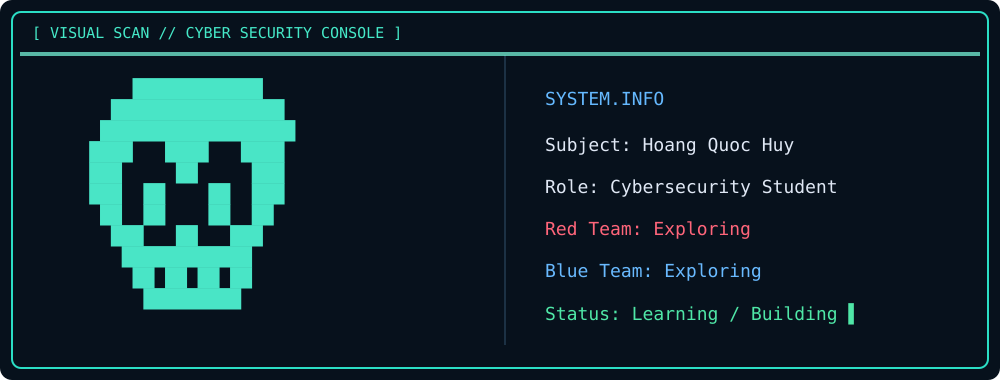
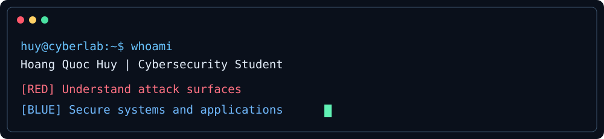

<div align="center">




  



</div>

## `> whoami`

```yaml
name: Hoang Quoc Huy
username: HoangQuocHuyDev
major: Cybersecurity / Information Security
university: Binh Duong University
location: Vietnam
interests: [Networking, Linux, Web Security, Software Development, AI]
status: Exploring Red Team and Blue Team fundamentals
```

I'm a **Cybersecurity student** exploring information security, networking, Linux and secure development. I also enjoy building real applications using web technologies, databases and AI. I practice security concepts in **authorized lab environments** and am still discovering my specialization.

<div align="center"></div>

## ⚔️ Red Team × 🛡️ Blue Team

| 🔴 Offensive Security — Learning | 🔵 Defensive Security — Learning |
|:--|:--|
| Reconnaissance & service discovery | Networking & TCP/IP fundamentals |
| Nmap, Kali Linux & isolated labs | Linux administration & permissions |
| Metasploit in authorized practice labs | Authentication & role-based access |
| Web security fundamentals | Secure coding & application design |

## 🧰 Cybersecurity & Networking Toolkit

<div align="center">

    

</div>

## 💻 Programming Languages

<div align="center">

      

</div>

## ⚙️ Frameworks & Libraries

<div align="center">

      

</div>

## 🗄️ Databases & Cloud

<div align="center">

       

</div>

## 🚀 Featured Projects

| Project | Description | Technologies |
|:--|:--|:--|
| [📚 StudyMate AI](https://github.com/HoangQuocHuyDev/StudyMate-AI) | AI learning-document summarization and retrieval project | Python, React, Gemini API, RAG |
| [💉 Vaccination Management](https://github.com/HoangQuocHuyDev/vaccination-management-system) | Vaccination appointments, records, inventory and role-based access | FastAPI, React, PostgreSQL, JWT |
| [🌱 Smart Irrigation](https://github.com/HoangQuocHuyDev/tuoi_cay_ai) | ESP32 sensors, MLP and fuzzy-logic irrigation decisions | Python, ESP32, ML |
| [📦 Inventory Management](https://github.com/23050093-HoangQuocHuy/quanlykho-fastapi) | Stock, orders, suppliers and inventory tracking | FastAPI, SQLAlchemy, PostgreSQL |

*Academic and learning projects. Check links after any repository ownership transfers.*

## 🦠 Cyber Threat Scanner

<div align="center"></div>

*Animated educational visualization only — not a real malware scan or live threat detection.*

## 📊 GitHub Statistics

<div align="center">


</div>

*External statistics services can occasionally be unavailable.*

## 🎯 Currently Learning

```text
CYBERSECURITY
├── Networking & TCP/IP
├── Linux Administration
├── Reconnaissance in Authorized Labs
├── Web Application Security
└── Defensive Security Fundamentals

DEVELOPMENT
├── Secure APIs & Authentication
├── Database Design
├── Cloud & Deployment
└── AI Integration
```

## 📬 Connect

<div align="center">

[](https://github.com/HoangQuocHuyDev)

**SECURE WHAT YOU BUILD • UNDERSTAND WHAT YOU PROTECT**

</div>
